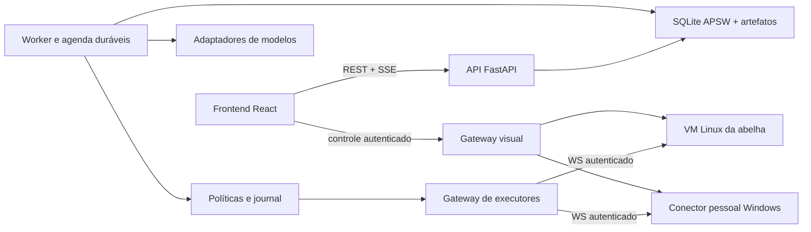

# Arquitetura do Bees

Decisão vigente: [ADR 0001](adr/0001-foundation.md).

## Componentes

O diagrama mostra o desenho alvo. A base atual contém API de saúde/status, frontend de diagnóstico e packages/core com estado persistente, migrações, repositórios e adaptadores remoto/local de texto e funções. A CLI oferece conversa persistida; funções são pedidos validados, ainda sem execução. Worker, políticas, gateways e ambientes continuam pendentes; artefatos têm metadados persistentes, não publicação de blobs. Veja [persistência](persistence.md) e [modelos](providers.md).

## Contratos

| Contrato | Responsabilidade |
| --- | --- |
| ModelAdapter | Normalizar capabilities, mensagens, tools, streaming e uso; nenhum estado exclusivo do fornecedor. |
| UnitOfWork/Repositories | Transações de domínio, revisão e migrações; não abrir transação durante ferramenta. |
| PolicyService | Avaliar política atual, escopo/parâmetros e decisões humanas antes de ação. |
| ExecutorTransport | Pareamento, capabilities, comando versionado, fencing e resultado. |
| ActionJournal | Intenção, início, confirmação e resultado desconhecido; reconciliar antes de repetir. |
| EnvironmentAdapter | Provisionamento/status, persistência, controle e limites reais. |
| SecretStore | Referências opacas, acesso controlado, rotação e ausência no contexto/log. |
| ArtifactStore | Staging/publicação, versões, hashes e download autorizado. |
| EventStore/Outbox | Eventos de estado duráveis e entrega deduplicável. |
| RoutineStore | Agenda IANA, ocorrência única, atraso/sobreposição e estado persistido. |

Um controle por tela. Uma conexão não concede acesso. Nenhum fallback silencioso de máquina/provedor. Rotinas e agentes usam a mesma política atual.

## Organização prevista

- apps/api e apps/web: primeira base executável.
- packages/core: persistência e contratos/drivers de modelo implementados; apps/worker, apps/connector e runtime serão criados conforme a implementação do comportamento.
- docs: decisões, instalação e contratos públicos, sem depender dos arquivos locais ignorados.

O plano de controle pode rodar localmente ou em VPS. Computador próprio é VM, hospedada no mesmo host quando suportado ou em infraestrutura do usuário. Banco não é compartilhado com executores e não fica em filesystem de rede.
